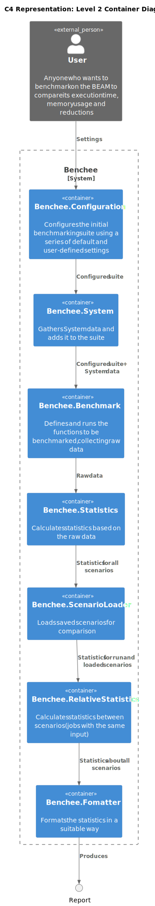
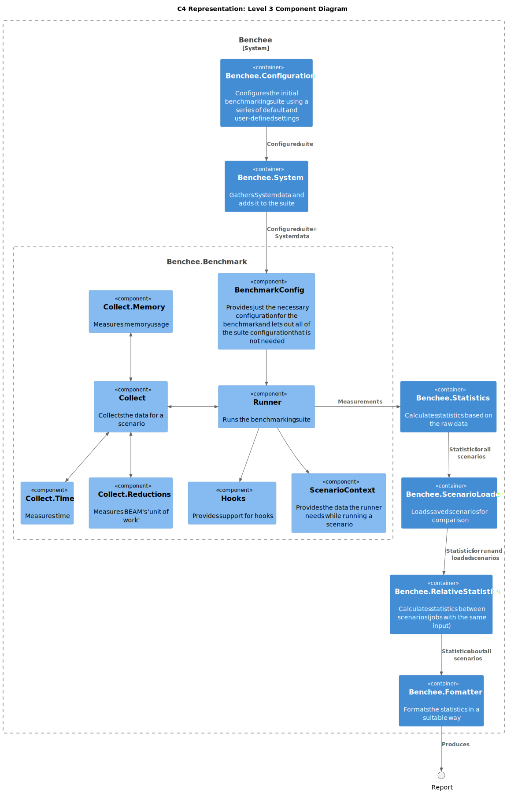

# Architecture

This folder contains notes about benchee's architecture and some diagrams showing said architecture.

The architecture is relatively simple but flexible and could probably best be described as _pipes_.
The goal is to allow for extension and customization.
There is a big structure called `Benchee.Suite` which is progressively enhanced by multiple steps.
Each of these steps should be exchangeable and they're all part of the public API.
Each step is just a function to make using and exchanging them easy.

The order of these steps is best illustrated by the implementation of `Benchee.run/2` to see in which order they're called:

```elixir
def run(jobs, config \\ []) when is_list(config) do
  config
  |> Benchee.init()
  |> Benchee.system()
  |> add_benchmarking_jobs(jobs)
  |> Benchee.collect()
  |> Benchee.statistics()
  |> Benchee.load()
  |> Benchee.relative_statistics()
  |> Formatter.output()
  |> Benchee.profile()
end

defp add_benchmarking_jobs(suite, jobs) do
  Enum.reduce(jobs, suite, fn {key, function}, suite_acc ->
    Benchee.benchmark(suite_acc, key, function)
  end)
end
```

## C4 diagrams

### Context


### Container



### Component




## Working with the diagrams

To render them you need a a tool such as [the PlantUML plugin for VScode](https://marketplace.visualstudio.com/items?itemName=jebbs.plantuml).
For that to work, you also need to install `graphviz` (`sudo apt-get install graphviz`)
